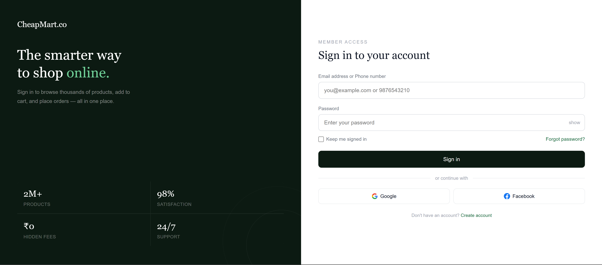
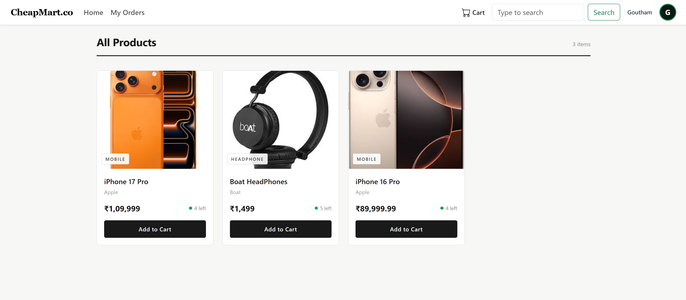
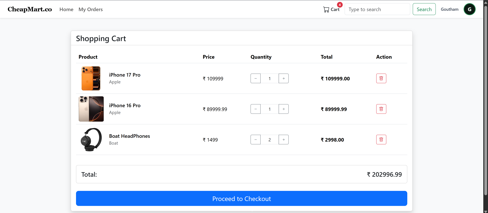
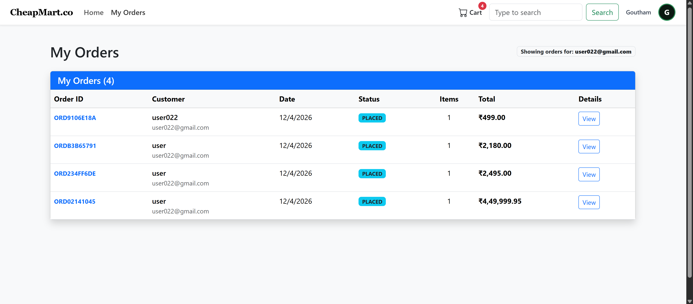

# 🛒 E-Commerce Web Application

<p align="center">
  <b>Full-Stack E-Commerce Platform built with Spring Boot</b><br/>
  Scalable backend • Clean architecture • Real-world features
</p>

<p align="center">
  
  
  
  
  
  <!--  -->
</p>

🚀 Live Demo

## 📌 Overview

This is a full-stack E-Commerce application built using Spring Boot, designed to simulate real-world online shopping systems.

It includes core functionalities like authentication, product management, cart operations, and order processing using a scalable layered architecture.

---

## ✨ Features

✔️ User Registration & Login
✔️ Product Catalog Management
✔️ Add to Cart / Remove from Cart
✔️ Order Placement System
✔️ Admin Controls (Manage Products & Orders)
✔️ RESTful API Design
✔️ Layered Architecture (Controller → Service → Repository)

---

## 🧠 Architecture

```id="arch123"
Client (Browser / Postman)
        ↓
Controller Layer
        ↓
Service Layer (Business Logic)
        ↓
Repository Layer (JPA)
        ↓
MySQL Database
```

---

## 🛠️ Tech Stack

| Category   | Technology            |
| ---------- | --------------------- |
| Backend    | Java, Spring Boot     |
| Database   | MySQL                 |
| ORM        | Hibernate / JPA       |
| Frontend   | HTML, CSS, JavaScript |
| Build Tool | Maven                 |
| Tools      | Git, GitHub, Postman  |

---

## 📂 Project Structure

```id="struct321"
src/
 ├── main/
 │   ├── java/com/ecommerce/
 │   │   ├── controller/
 │   │   ├── service/
 │   │   ├── repository/
 │   │   ├── model/
 │   │
 │   ├── resources/
 │       ├── application.properties
 │       ├── static/
 │       ├── templates/
```

---

## ⚙️ Setup & Installation

### 1️⃣ Clone Repository

```id="clone12"
git clone https://github.com/your-username/Ecommerce-Website.git
cd Ecommerce-Website
```

### 2️⃣ Configure Database

```id="db123"
spring.datasource.url=jdbc:mysql://localhost:3306/ecommerce_db
spring.datasource.username=root
spring.datasource.password=your_password
spring.jpa.hibernate.ddl-auto=update
```

### 3️⃣ Run Application

```id="run123"
mvn spring-boot:run
```

---

## 🌐 API Endpoints (Sample)

| Method | Endpoint           | Description      |
| ------ | ------------------ | ---------------- |
| POST   | /api/auth/register | Register user    |
| POST   | /api/auth/login    | Login user       |
| GET    | /api/products      | Get all products |
| POST   | /api/cart          | Add to cart      |
| POST   | /api/orders        | Place order      |

---

## 📸 Screenshots

### Login Page



### Home Page



### Cart Page



### Order Page



---

## 📈 Future Enhancements

* 🔐 JWT Authentication with Spring Security
* 💳 Payment Integration (Razorpay / Stripe)
* 📦 Microservices Architecture
* ☁️ Cloud Deployment (AWS / Docker)
* ⚡ React Frontend (SPA)

---

## 🏆 Resume Impact

* Built a scalable **E-Commerce backend system using Spring Boot**
* Designed and implemented **RESTful APIs**
* Applied **layered architecture and clean coding practices**
* Gained hands-on experience with **real-world business logic**

---

## 🤝 Contributing

Contributions are welcome! Feel free to fork and improve.

---

## 📬 Contact

**Goutham Soma**
🔗 LinkedIn: https://linkedin.com/in/goutham-soma-020776270
💻 GitHub: https://github.com/Goutham-soma

---

<p align="center">
  ⭐ If you found this project useful, consider giving it a star!
</p>

---
